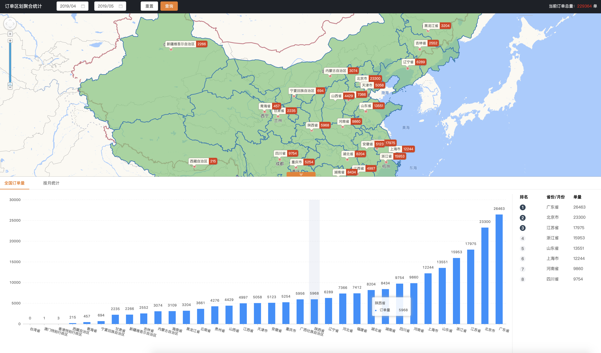

# cluster-map
基于高德地图聚合统计&统计图 [@giscafer](https://github.com/giscafer)

技术栈：`Angular + 高德 Web JS`

在线demo：https://gis520.github.io/cluster-map/

## Usage

- `npm install`
- `npm run start`
- 浏览器访问: `http://localhost:4200/`

## License 

-  [WebGIS入门实战](https://xiaozhuanlan.com/webgis)

